# Mappa dei collegamenti — "Frattura"
*Narrative Designer · 2026-06-25 (rev. 2026-06-29, allineato ai 6 file BIBBIA). Personaggi, fazioni e **impatto delle retrostorie sul presente**, in un solo grafo. Fonti: `BIBBIA/01_CANONE·02_CAST·03_STRUTTURA_E_MISTERI`. Lo SFONDO (Bestie/Commissione/Tesi) qui è esplicito per il team — nel romanzo NON si nomina, trapela soltanto.*

**Come leggere il grafo:**
- **Frecce piene** `→` = relazione/azione diretta. **Tratteggiate** `-.->` = legame nascosto / a distanza / di specchio. **Spesse** `==>` = il finale.
- I cinque blocchi colorati = i piani della storia: 🟣 sfondo nascosto · 🔴 Patto · 🔵 eroi · 🟢 Fossa · 🟡 mondo esterno.
- Le frecce etichettate **`retro:`** sono le retrostorie che premono sul presente.

```mermaid
graph TD
    %% ================= LO SFONDO (la macchina nascosta) =================
    subgraph SFONDO["🟣 LA MACCHINA NASCOSTA — lo sfondo (trapela soltanto)"]
        BESTIA["BESTIA DI VAEKH<br/>mente · memoria · identità<br/>quasi a soglia"]
        COMM["LA COMMISSIONE<br/>consiglio interno senza volto"]
        CORVIN["Corvin<br/>faccia tecnica · crede di comandare"]
        MIRELLE["Mirelle<br/>sperimentatrice · gente = materiale"]
        METODO["IL METODO<br/>forzare il legame · viene da fuori"]
        PZ["PUNTO ZERO<br/>la soglia della Bestia, in fondo"]
        TESI["I TESI<br/>conduttori tenuti vivi sulla soglia"]
    end

    %% ================= IL PATTO (maschera visibile) =================
    subgraph PATTO["🔴 IL PATTO DI FERRO — il regime (NON sa delle Bestie)"]
        CONSIGLIO["Consiglio del Patto"]
        SILENZIO["IL SILENZIO<br/>organo del Patto · INFILTRATO"]
        SEVRAN["Sevran<br/>inquisitore sincero"]
        COSS["Censore Coss<br/>firma le sparizioni"]
        BRANN["cap. Brann<br/>sicuro di sé e cieco"]
        LUCAN["Lucan †<br/>prefetto · la sua morte = il caso"]
        VOSSAR["Lord Vossar<br/>nobile che vende Convocati"]
    end

    %% ================= GLI EROI (POV) =================
    subgraph EROI["🔵 GLI EROI — i POV trascinati dentro"]
        SELENE["SELENE<br/>legge/usa la gente · nobile fuggita"]
        WICK["WICK<br/>mago-per-caso · legame LIBERO"]
        DORIAN["DORIAN<br/>ex Martello disertore · amava l'ordine"]
        BEDRIN["BEDRIN<br/>Fossa · vedovo · padre di Pim"]
    end

    %% ================= FOSSA / RETI / PROFONDO =================
    subgraph FOSSA["🟢 LA FOSSA — reti, culti, profondo"]
        SOREN["Soren †<br/>fondò il Sindacato"]
        MAELOR["Maelor<br/>la paura come arma"]
        NERISSA["Nerissa<br/>informazioni > lividi"]
        PIM["Pim<br/>figlia di Bedrin, 8 anni"]
        LIVIA["Livia<br/>Occhio Spezzato · industria del dolore"]
        GAREK["Garek<br/>diserta il culto"]
        NOMA["Noma<br/>Dissonanti · memoria"]
        TIMO["Timo<br/>corriere ragazzino"]
        KESH["Kesh †<br/>traccia minore"]
        AERIS["Aeris<br/>mercante di segreti"]
        CALIX["Calix<br/>valuta, non salva"]
        VEYNE["Veyne Tal<br/>competenza immobile"]
        VIAND["IL VIANDANTE<br/>conduttore FALLITO"]
    end

    %% ================= VERTICE / ARRIVISTI / PONTI =================
    MIRA["MIRA<br/>vuole decidere chi passa · vince abbastanza"]
    AUREL["Aurel<br/>ex inquisitore pentito"]
    HALRIC["Halric<br/>tradisce per convinzione"]
    THANE["Thane<br/>salva distruggendo carte"]

    %% ================= FAMIGLIE / RETROSTORIE =================
    RIVEN["Riven<br/>fratello di Selene · Convocato"]
    EDRAN["Edran<br/>fratello di Dorian · Convocato tornato"]

    %% ================= MONDO ESTERNO (da L4) =================
    subgraph ESTERNO["🟡 IL MONDO ESTERNO — geopolitica (da L4)"]
        SALE["Impero del Sale<br/>magia=eresia · DISTRUGGE"]
        PORTI["Lega dei Porti<br/>magia=merce · COMPRA"]
        YSHAR["Teocrazia di Yshar<br/>bestia-dio · vuole IL METODO"]
        MANG["I Mangiatori<br/>custodi della vecchia via"]
        TB["TERRA BRUCIATA<br/>una Bestia GIÀ caduta · il monito"]
    end

    %% ====== LEGAMI DELLO SFONDO ======
    COMM -->|forza i legami, tende il canale| BESTIA
    COMM --> CORVIN
    COMM --> MIRELLE
    COMM -->|infiltra e piega| SILENZIO
    COMM -->|eredita| METODO
    METODO -.->|prima prova di fuoco| TB
    TESI -->|regolazione vivente| BESTIA
    PZ --> TESI
    BESTIA -.->|se la spingono, cade come| TB

    %% ====== COMMISSIONE vs PATTO ======
    COMM -.->|paravento inconsapevole| CONSIGLIO
    CONSIGLIO --> SEVRAN
    CONSIGLIO --> COSS
    CONSIGLIO --> BRANN

    %% ====== EROI: legami interni ======
    SELENE <-->|si fidano a fatica| DORIAN
    WICK -->|desiderio non corrisposto| SELENE
    DORIAN -->|diffidenza poi rispetto| WICK
    SELENE -->|sorella| RIVEN
    DORIAN -->|fratello| EDRAN
    BEDRIN -->|vive per| PIM

    %% ====== RETROSTORIE → PRESENTE ======
    SOREN -->|retro: la sua morte apre la guerra| MAELOR
    SOREN -->|retro: eredità contesa| NERISSA
    MAELOR -->|rapisce| PIM
    BEDRIN -->|sgozza Maelor per Pim| MAELOR
    NERISSA -->|alleata fredda| SELENE
    AUREL -->|retro: consegnò Edran, il caso Vaeldrin| EDRAN
    AUREL -.->|retro: colpa verso| DORIAN
    RIVEN -->|diventa| TESI
    EDRAN -->|slittato fuori dal canale| TESI
    KESH -->|retro: traccia minore| SELENE
    LUCAN -->|la sua morte mette Dorian sul caso| DORIAN

    %% ====== CULTI / FOSSA / PROFONDO ======
    LIVIA --> GAREK
    GAREK -->|diserta, passa agli eroi| DORIAN
    NOMA --> TIMO
    NOMA --> KESH
    AERIS -->|vende verità che peggiorano| SELENE
    CALIX -->|legge Wick: non spezzi| WICK
    CALIX --> VEYNE
    VIAND -.->|specchio: legame spezzato vs libero| WICK

    %% ====== PONTI / ARRIVISTI ======
    MIRA -->|tratta con, poi ci entra| COMM
    MIRA -.->|rivale al Vertice| CONSIGLIO
    HALRIC -.->|tradisce a ogni svolta| DORIAN
    THANE -->|aiuta di nascosto| SELENE

    %% ====== MONDO ESTERNO → MONOPOLIO ======
    SALE -.->|vuole distruggere la fonte| COMM
    PORTI -.->|vuole comprare il controllo| COMM
    YSHAR -.->|vuole il metodo per sé| METODO
    MANG -.->|sa da dove viene| METODO
    WICK -->|capisce cos'è da Yshar/Mangiatori| METODO

    %% ====== IL FINALE (Punto Zero) ======
    WICK ==>|terza via: regge il canale, sacrificio| PZ
    SELENE ==>|apre senza nuova prigione| PZ
    MIRA ==>|vuole impadronirsene| PZ
    COMM ==>|spingere vs frenare| PZ

    %% ====== STILI ======
    classDef sfondo fill:#241f33,stroke:#8b78c0,color:#efeaff,stroke-width:2px
    classDef patto fill:#33211f,stroke:#c07878,color:#ffeaea
    classDef eroi fill:#1d2f35,stroke:#5fb0b2,color:#e7feff,stroke-width:2px
    classDef fossa fill:#1f3326,stroke:#6fb585,color:#eafff0
    classDef esterno fill:#332e1f,stroke:#c0a96f,color:#fff8e6
    classDef ponte fill:#2c2733,stroke:#a98fc0,color:#f3eaff
    classDef fam fill:#2a2030,stroke:#b87fa0,color:#ffeaf6

    class BESTIA,COMM,CORVIN,MIRELLE,METODO,PZ,TESI sfondo
    class CONSIGLIO,SILENZIO,SEVRAN,COSS,BRANN,LUCAN,VOSSAR patto
    class SELENE,WICK,DORIAN,BEDRIN eroi
    class SOREN,MAELOR,NERISSA,PIM,LIVIA,GAREK,NOMA,TIMO,KESH,AERIS,CALIX,VEYNE,VIAND fossa
    class SALE,PORTI,YSHAR,MANG,TB esterno
    class MIRA,AUREL,HALRIC,THANE ponte
    class RIVEN,EDRAN fam
```

---

## Le retrostorie che premono sul presente (riassunto)
| Retrostoria (passato) | Personaggio | Impatto sul presente |
|---|---|---|
| **La Caduta della Terra Bruciata** (prima prova del metodo) | la Commissione | È il **modello** del piano e il **monito** del finale: cosa accade se la Bestia cade (L4 → L7). |
| **Il metodo "viene da fuori"** | Mangiatori, Yshar → Commissione | Vaekh è un **esperimento riuscito**, non l'origine: alza la posta e apre il mondo vasto (L4). |
| **Soren perde i suoi alla "sfortuna" e finisce in Fossa** | Soren | La sua morte (vigilia) accende la **guerra Maelor↔Nerissa** (L1–L2) e dà a Bedrin il suo punto di rottura. |
| **Il caso Vaeldrin: Aurel consegna Edran** | Aurel, Dorian, Edran | Spezza la famiglia di Dorian → Dorian entra nel Patto e diserta; Edran è il **Convocato tornato** = la prima crepa e una chiave del finale (L1/L4/L7). |
| **La moglie di Bedrin muore di febbre** | Bedrin, Pim | Bedrin vive solo per **Pim**: è la leva con cui Maelor lo piega e la ragione del suo **scatto** che uccide Maelor (L1–L2). |
| **Riven Convocato "in gloria"** | Selene, Riven | Il motore di Selene: dalla **fierezza** al sospetto, fino a scoprire che Riven è un **Teso** (vigilia → L5 → L7). |
| **Kesh inizia a guardare i Convocati e muore** | Kesh | Traccia minore; i primi fili vengono dai **registri di Bedrin** (L1). |
