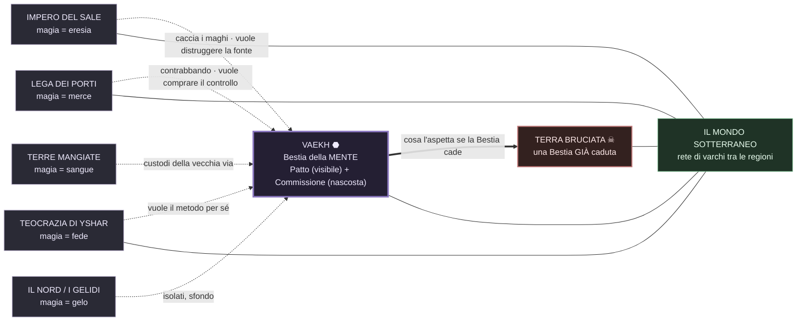

# Il mondo e le regioni — "Frattura"
*Narrative Designer · 2026-06-25 (rev. 2026-06-29, allineato ai 6 file BIBBIA). La vera "mappa del mondo": **una scheda per regione** (Bestia · magia · come ci si lega · costo · cultura/potere · rapporto con Vaekh · agenda verso il monopolio · ruolo nella saga). Sostituisce il vecchio `MAPPA_MONDO.html` (vuoto). Fonti: `BIBBIA/01_CANONE` (§1, §8).*

## Mappa d'insieme
*Vaekh al centro; ogni regione ha la **sua** Bestia e un rapporto diverso con la magia. Sotto, il **mondo sotterraneo** collega i varchi tra le regioni: si può viaggiare sotto.*

---

## ⬣ VAEKH — la città-stato (il centro della saga)
- **Bestia:** della **mente / memoria / identità** — legge e (a fatica) riscrive le persone.
- **Magia (da lei):** leggere stati e bugie, sentire i punti di rottura, toccare la memoria. Da qui: la **Cicatrice** ("legge e corregge"), il **Silenzio** ("rifinisce"), i **Dissonanti** (memoria), il dono di **Selene**, i rari **maghi-per-caso** (Wick).
- **Come ci si lega:** per caso, vicino ai varchi di Fossa/Fondamenta — oppure **forzato** dalla Commissione (rito).
- **Costo:** il confine tra sé e gli altri si assottiglia; chi legge a fondo **porta via pezzi** che non tornano.
- **Potere:** il **Patto di Ferro** (regime fascista, visibile, *ignaro delle Bestie*) sopra; la **Commissione** (consiglio senza volto) sotto, che gestisce **Convocazione** e **Silenzio**.
- **Ruolo nella saga:** il **laboratorio riuscito** del monopolio. Tutto comincia e finisce qui (Punto Zero).

## 🜂 IMPERO DEL SALE — la repressione
- **Bestia:** **dormiente** (sprofondata da generazioni; la sua magia quasi non si manifesta). Il Sale teme la magia e la chiama **eresia/maledizione**: le leggi sull'eresia sono, sotto la fede, un **contenimento** che la tiene addormentata.
- **Magia:** rara e **braccata**; chi si lega è un condannato.
- **Cultura/potere:** vasto, disciplinato; **imperatori seri e intelligenti**; **cacciatori di maghi**. Intrighi di corte, infiltrazione, fughe.
- **Rapporto con Vaekh:** ostile per principio. Un mago, da loro, va nascosto o ucciso.
- **Agenda verso il monopolio:** vuole **distruggere la fonte**. Se intuisce cosa cova Vaekh, la vede come un abominio da estirpare — i suoi cacciatori diventano cacciatori della Commissione (e degli eroi che "puzzano" di magia).
- **Ruolo nella saga:** prima tappa del mondo vasto (L4): la magia vista come peccato; un cacciatore fiuta Wick.

## 🌊 LEGA DEI PORTI — il mercato
- **Bestia:** dei **mari** — marea / scambio / "far girare le cose".
- **Magia:** fortuna, correnti, scambio. La Lega la **usa senza sapere cosa sia**: la **compra e la vende** come servizio, con tecniche tramandate.
- **Costo:** ogni favore della marea ne **toglie** un altro; debiti che tornano.
- **Cultura/potere:** federazione mercantile; porti, gru, magazzini; **schiavi-maghi** al collare, contrabbando.
- **Rapporto con Vaekh:** affari. Nessuna morale, solo prezzo.
- **Agenda verso il monopolio:** vuole **comprare/spartire** il controllo — l'affare del secolo; tratterebbe con la Commissione, con Mira, con chiunque vinca.
- **Ruolo nella saga:** L4 — la magia come merce; Wick scoperto come "selvatico" di pregio.

## ⛪ TEOCRAZIA DI YSHAR — la fede
- **Bestia:** della **carne** — guarigione-e-marciume. Venerata come **dio** (senza sapere cosa sia).
- **Magia:** chiudere ferite, far crescere o marcire la carne. I **"santi" sono maghi**.
- **Come ci si lega:** un **rito del clero** che "apre" la persona (taglio, sostanza, parole). Il clero **custodisce il metodo**.
- **Costo:** ciò che guarisci qui **marcisce** altrove; i santi pagano col proprio corpo.
- **Cultura/potere:** pellegrinaggi, templi, fanatismo; un clero potente.
- **Agenda verso il monopolio:** **teme** che Vaekh monopolizzi (minaccia la sua Bestia-dio) e vorrebbe **prendere il metodo** per sé.
- **Ruolo nella saga:** L4 — la rivelazione-chiave: i santi sono **fatti** col rito; il potere di Wick invece è **venuto libero**.

## 🩸 TERRE MANGIATE / I MANGIATORI — la stirpe
- **Bestia:** del **sangue / stirpe**.
- **Magia:** legata al sangue e alla discendenza.
- **Come ci si lega:** **mangiare un pezzo della propria Bestia** (rito, tabù).
- **Costo:** il legame passa nel **sangue** — vincola la stirpe, non solo l'individuo.
- **Cultura/potere:** tribù sperduta; riti, tabù; **sanno più di quanto sembri**.
- **Agenda verso il monopolio:** **custodi ambigui** della "vecchia via" da cui viene il metodo. Possono **aiutare** gli eroi a capire o **difendere** il segreto.
- **Ruolo nella saga:** L4 — la radice storica del metodo; spiegano da dove viene tutto.

## ❄ IL NORD / I GELIDI — l'isolamento
- **Bestia:** del **gelo / immobilità**.
- **Magia:** fermare, raffreddare, conservare, "addormentare" il movimento.
- **Come ci si lega:** riti **sciamanici** nel ghiaccio.
- **Costo:** il gelo entra dentro — il cuore rallenta, le emozioni si congelano.
- **Cultura/potere:** terre fredde, popolo duro, sopravvivenza, mostri, isolamento.
- **Agenda verso il monopolio:** **sfondo**, da sviluppare (potenziale alleato disperato o regione-rifugio).
- **Ruolo nella saga:** riserva narrativa (L5+); colore e possibile via di fuga.

## ☠ LA TERRA BRUCIATA — il monito
- **Bestia:** **caduta** — rovina / disfacimento. Andò in **sovraccarico** secoli fa.
- **Stato:** terra morta, **maghi impazziti**, **mostri liberi**, aria che brucia; non guarisce.
- **Verità nascosta:** non fu un incidente — fu la **prima prova** del metodo (un'arma, non una disgrazia).
- **Agenda:** nessuna — è un cadavere di mondo.
- **Ruolo nella saga:** il **monito e l'anticipazione del finale**: è **cosa aspetta Vaekh** se la Bestia cade. Camminata in L4 (Wick ci vede sé stesso).

---

## ⬇ IL MONDO SOTTERRANEO (sotto Vaekh e oltre)
- **Le Fondamenta** (Cantine → Giardino → Coro → Bocche → **Soglia Nera**): il ventre; dove i **falliti** (mostri) sono trascinati e contenuti, e dove la Commissione nasconde le sue operazioni.
- **La Cicatrice:** zona che "legge e corregge" chi entra (la magia della Bestia che trapela); le sue creature hanno **origine umana** deformata.
- **Punto Zero:** il fondo, sul bordo della Bestia, dove sono tenuti i **Tesi**: il sito del **climax**.
- **Idea forte:** il sottosuolo **collega i varchi** tra le regioni — una **mappa parallela** del mondo di sopra. Si viaggia sotto (è così che il gruppo esce da Vaekh in L4).
